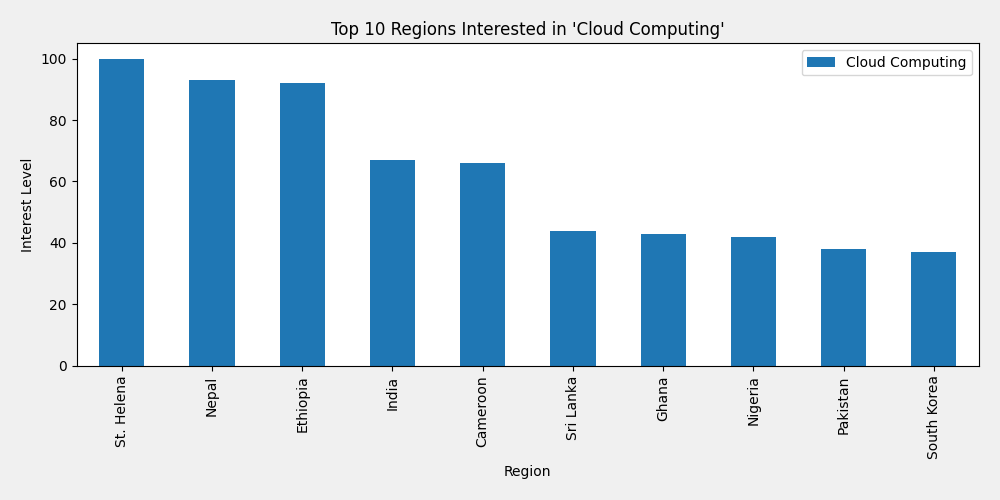

# 📊 Google Trends Analysis: Cloud Computing

This Jupyter Notebook uses the [PyTrends](https://github.com/GeneralMills/pytrends) API to explore and analyze the popularity of the search term **"Cloud Computing"** using real-time Google Trends data.

It walks through how to:
- 📈 Analyze interest over time (global, past 12 months)
- ⏳ Zoom in on a specific time window (January 2024)
- 🌍 Visualize interest by region
- 🔎 Explore related search queries
- 💡 Extract autocomplete keyword suggestions

Each section includes clear explanations, cleaned data, and visualizations.

---

## 📷 Sample Visualization

*Bar chart showing the top 10 regions with the highest search interest in "Cloud Computing".*

---

## 📌 Key Insights

- "Cloud Computing" has steady global interest, with periodic peaks.
- Countries with strong IT industries tend to dominate search volume.
- Related queries reveal associated platforms, certifications, and technologies.

---

## 🧠 What You'll Learn

- How to work with the Google Trends API (`pytrends`)
- How to process and clean time-series data using `pandas`
- How to visualize trends using `matplotlib`
- How to extract keyword suggestions and related search intent

---

## 🔒 Data Source

All data is fetched live from [Google Trends](https://trends.google.com) via the `pytrends` library.  
The data is **normalized**: values are relative (0–100), where 100 indicates the peak popularity for a term in a given region or time period.
